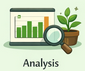
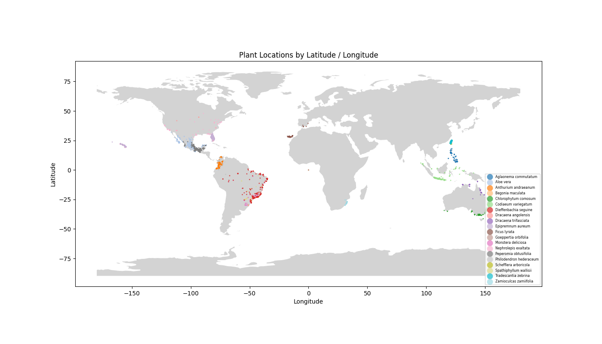
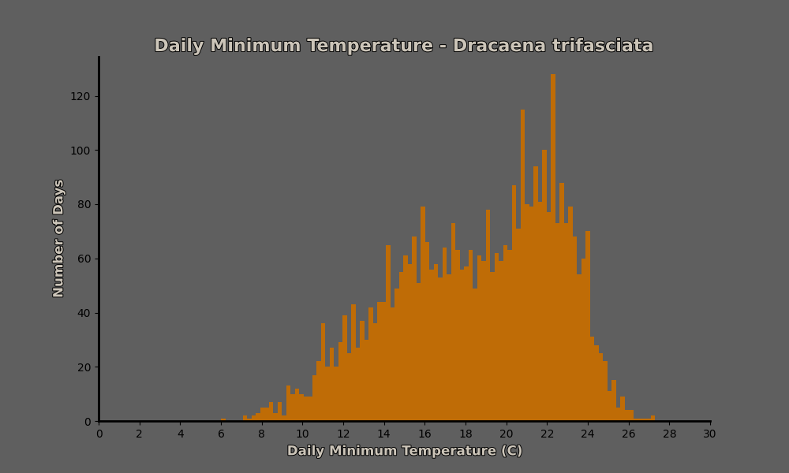
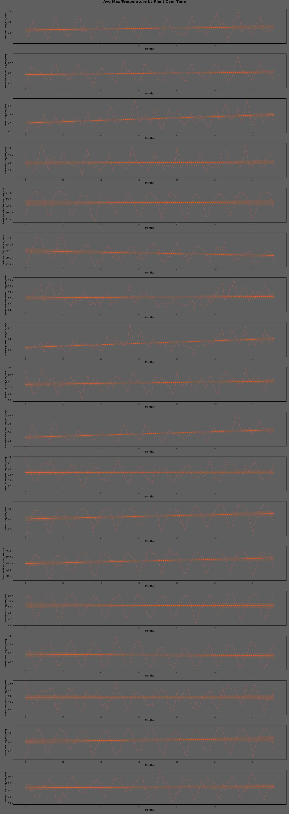
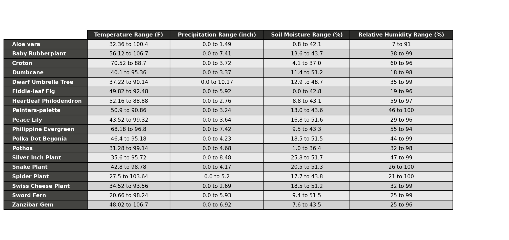
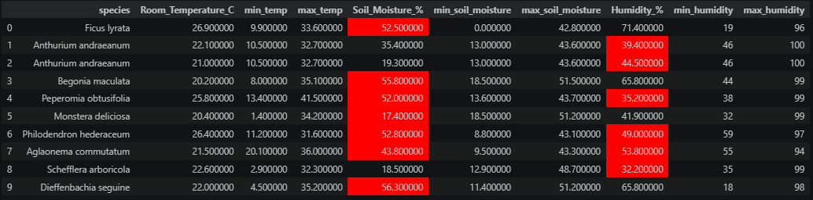

# 🌱 Native Range Historical Weather Data for Common Houseplants🌱

In a search for data linking environmental factors to general houseplant health, it was discovered there were limited datasets that had any solid data collected in a home or home-like environment, and those that did exist were often synthetic. 

Assuming a natural habitat exhibits the best conditions for a given species, this analysis defines ideal conditions for common house plants based on native range weather conditions.

---

## Quick Nav

<p align="center">
    <a href="#overview"></a>
    <a href="#project-structure"></a> 
    <a href="#data"></a>
    <a href="#setup"></a>
    <a href="#usage"></a>
    <a href="#analysis"></a>
    <a href="#results"></a>
</p>

## Overview

Twenty common houseplants were chosen to develop a dataset for ideal keeping conditions based on weather and conditions from their most common native range.

This dataset can be used to directly pull keeping parameters, for further analysis to gain insight for the user's specific need, or it could be used to create machine learning models and be used in conjunction with realtime sensor data.


## Project Structure

```bash
Ideal_Conditions_Houseplants
├── assets
│   ├── charts
│   │   ├── avg_humidity.png
│   │   ├── avg_max_temp.png
│   │   ├── avg_min_temp.png
│   │   ├── coordinateMap.png
│   │   ├── dailyMinTempTestHist.png
│   │   ├── out_of_range_values.PNG
│   │   └── plant_ranges.png
│   └── thumbnails
│       ├── analysis.png
│       ├── data.png
│       ├── filestructure.png
│       ├── overview.png
│       ├── results.png
│       ├── setup.png
│       └── usage.png
├── data
│   ├── eleven_year_weather_by_species.csv
│   ├── gbif_occurrences.csv
│   └── Indoor_Plant_Health_and_Growth_Factors.csv
├── notebooks
│   └── datacleaning.ipynb
├── scripts
│   └── sqldb_init.py
├── SQL
│   └── houseplants.db
├── README.md
└── requirements.txt

```

## Data

```eleven_year_weather_by_species.csv``` was generated by a function calling the open-meteo API mapping the specified weather data by day over an 11 year period (Jan. 2015 - Dec. 2025) to a plant species' natural habitat. The coordinates for the habitat were taken from the most common country the plant was found in, then a central latitude and longitude were determined to get a good representation for the cluster.

Those coordinates used to determine the central latitude and longitudes are located inside ```gbif_occurrences.csv```. The dataset was pulled from ```htttps://www.gbif.org```.

```Indoor_Plant_Health_and_Growth_Factors.csv``` was the dataset that sparked this analysis. It was pulled from Kaggle, and although it wasn't labeled synthetic, it likely is based on the extremely low correlation values of the data. The plant names used in the rest of the analysis were taken from this dataset.

## Setup

#### Follow the following to set up this project locally.

1. Clone the repository
```bash
git clone https://github.com/ewaldZst/Ideal_Conditions_Houseplants.git
```

2. Navigate to the cloned directory
```bash
cd Ideal_Conditions_Houseplants
```

3. Create a virtual environment
* Linux / macOS
```bash
python3 -m venv .venv
```
* Windows
```powershell
python -m venv .venv
```

4. Activate the virtual environment
* Linux / macOS
```bash
source .venv/bin/activate
```
* Windows
```powershell
.venv/Scripts/activate
```

5. Install dependencies
```bash
pip install -r requirements.txt
```

6. Launch VS code and select the correct kernel
```bash
code .
```

## Usage

Currently the only thing to do is run the notebook after dependency installation. You can try changing some values for the graphing. The ```export_weather_csv()``` function that generated ```eleven_year_weather_by_species.csv``` will not work as it requires a paid API key.


## Analysis

More analysis to follow.

Example graph showing original coordinate data from ```gbif_occurences.csv``` mapped:



Example graph showing the distribution of minimum temperatures (degrees C) by day for the species Dracaena trifasciata taken from ```eleven_year_weather_by_species.csv```.



Figure showing the time series analysis of each plant's average max temperature over 11 years.




## Results

Table for the ideal ranges for houseplants based on their most common native range.



Example of flagging acute plant measurements based on the ranges defined from the wild plant weather data.



## Next Steps

I would like to continue exploring the data to see if the most common native range for each plant has shifted over time and then look into why that is. Climate change? Deforestation?

I would also like to finish hooking up real life sensor data and append rows to the plant_assessments SQL table, then spot check it upon append to flag if any parameters are out of range. Then have that notify a plant owner in some way.

## Ackowledgements

This project used Claude code sparingly to assist with formatting of some charts which is noted in the notebook where applicable.
This project used the following libraries
 - pandas as pd
 - matplotlib.pyplot
 - matplotlib.patheffects
 - seaborn
 - geopandas
 - geodatasets
 - datetime
 - requests
 - sqlite3
